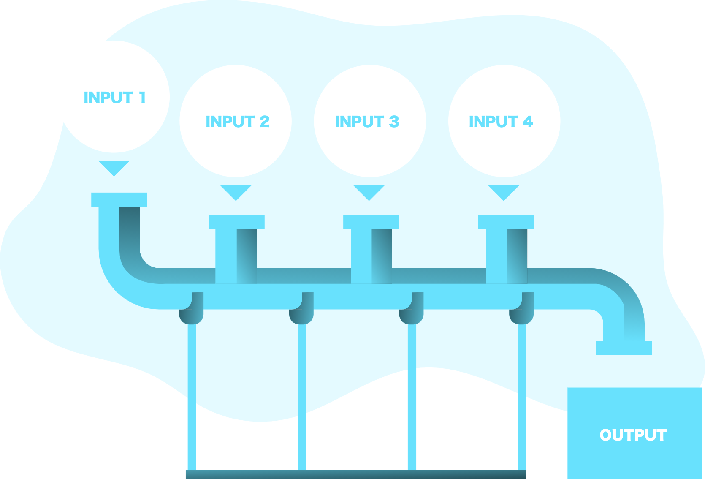

# SalaryPrediction
## Goal: To predict Salary based on different job qualifications/ employee metadata from the HR department.
### Useful for **both** parties in the hiring process:
- *Employees*: Useful for job hunters and candidates to negotiate their proper salary based on qualifications like: years of Experience and Industry worked in.
- *Employers*: Informative for companies hiring to make sure they're paying future employees the appropriate amount; furthermore, helps reduce costs while hiring the most qualified.

### 3 Main Notebooks: 
  1. Exploratory Data Analysis (EDA)
  2. Base Model Predictions for Salary
  3. Tuning Hyperparameters from Baseline Models

### The Languages and Technologies used in this project are:
- Visualization: Seaborn, Matplotlib, eli5
- Data Manipulation: Pandas, Numpy
- Machine Learning - models included are:
  - Scikit-Learn
    - Linear Regression
    - Random Forest Regressor
    - Gradient Boosting Regressor
  - LightGBM
    - Light GBM Regressor
  - XGBoost
    - XGBoost Regressor
  
## Outline the 4D Process:
  1. **Define** the Problem
    - ***Notebook: 'Exploratory Data Analysis (EDA)'***
      - **Problem**: Employees and Employers often have a hard time determining the optimal salary for individuals based on their qualifications. 
      - **Goal**: Studying this HR dataset and creating a Regression algorithm to predict salaries based on these features.
  2. **Discover** Inights and Trends
    - ***Notebook: 'Exploratory Data Analysis (EDA)'***
      - Understand the Numerical and Categorical data:
        1. **Numerical**
            - **Salary**: Target Feature & pay of each employee
            - **yearsExperience**: Amount of experience the employee has
            - **milesFromMetropolis**: Distance from metropolis of the employee
        2. **Categorical**
            - **CompanyId**: Id of the company the employee works for
            - **jobType**: Level on the Corporate ladder
            - **degree**: Level of education
            - **major**: Type of major
            - **industry**: Industry the employee works in
      - Identify outliers, missing, and duplicate data
        - **Remove Salaries of 0** for individuals with high qualifications since it also offers low predictive signal
      - Locate trends and correlations for features vs. salary:
        - *Salary increases* as:
          - **jobType** on the Corporate ladder gets better
          - **degree** of education is more advanced
        - *Salary increases* for individuals that:
          - Are Math, Business, or Engineering **majors**
          - Are working in Finance, Oil, or Web **industries**
          - Have more **YearsExperience**
        - *Salary decreases* as **milesFromMetropolis** increases -- *negatively correlated*
      - Understand Distributions of each of the features:
        - Salary has a Gaussian or *Normal* Distribution
        - All other features ahve a *Uniform* Distribution
      - Create and Pickle: Train, Validation, and Test data
  3. **Develop** Features and Models
    - ***Notebook: 'Base Model Predictions for Salary'***
      - Find base MSE scores for each model and pre-determined parameters
        - Random Forest Regressor: 470.92
        - XGB Regressor: 395.18
        - Linear Regression: 384.62
        - Light GBM Regressor: 372.05
        - Gradient Boosting Regressor: 362.09
      - Feature Importance varies depending on whether the algorithim is a *boosting* regressor
   - ***Notebook: 'Tuning Hyperparameters from Baseline Models'***
      - MSE Scores on *Validation data* for models after Tuned:
        - Random Forest Regressor: 370.82
        - XGB Regressor: 357.51
        - Linear Regression: 384.62 -- Scores stays *constant* since parameters cannot be tuned
        - **Light GBM Regressor: 356.42**
        - Gradient Boosting Regressor: 356.78
  4. **Deploy** Pipelines and Solutions
      - The optimal model will be the **Light GBM Regressor** as it provides the **lowest MSE** and **fastest** hyperparameter tuning time

